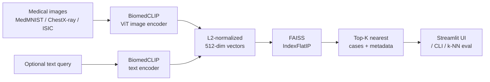

# MedEmbed

> Visual similarity search for medical images using frozen vision-transformer embeddings.

[](https://www.python.org/downloads/)
[](LICENSE)

MedEmbed turns a medical image into a semantic fingerprint using a pretrained vision-language transformer ([BiomedCLIP](https://microsoft.github.io/BiomedCLIP/)) and retrieves visually similar cases from a FAISS index using frozen model embeddings. It also supports text queries ("colorectal adenocarcinoma with desmoplastic stroma") against the same image index, CLIP-style.

It's a minimal, honest take on the pattern underlying most modern clinical retrieval systems: frozen foundation model + vector index + thin UI. Build it once, point it at any medical imaging dataset, and you have a working "find cases like this" tool.

---

## Why

Radiologists, pathologists, and biomedical engineers routinely ask: *"have we seen something like this before?"* The textbook answer is a case library, but nobody has time to browse one. A well-pretrained vision transformer already knows enough about medical imagery that its frozen embeddings support useful similarity search out of the box — you don't need to fine-tune, you don't need a GPU at query time, and you don't need labeled data.

The repository includes embedding and indexing modules, query and evaluation commands, and a Streamlit demo.

## Features

- **Frozen BiomedCLIP backbone** (15M biomedical image-text pairs, PubMed Central)
- **Pluggable model registry** — swap in generic CLIP ViT-B/16 or ViT-B/32 in one line
- **FAISS inner-product index** on L2-normalized vectors (cosine sim, exact search)
- **Image OR text queries** against the same index (multimodal retrieval)
- **k-NN evaluation harness** — macro-F1 + per-class report on any MedMNIST split
- **Streamlit demo app** with side-by-side query + top-K thumbnails
- **Core unit tests** for NumPy utilities and the FAISS index

## Architecture



Every piece is replaceable: a different backbone, a different dataset, an approximate FAISS index (`IndexIVFFlat`, `IndexHNSW`) when you scale past a few hundred thousand vectors.

## Quickstart

```bash
# 1. Clone and install
git clone https://github.com/amiralihs2/medemed.git
cd medemed
python -m venv .venv && source .venv/bin/activate
pip install -r requirements.txt
pip install -e .

# 2. Build an index over 2000 training-set PathMNIST tiles
python scripts/build_index.py \
    --dataset pathmnist --split train --max-samples 2000 \
    --model biomedclip --out artifacts/pathmnist_train

# 3. Query with an image
python scripts/query.py \
    --index artifacts/pathmnist_train \
    --image path/to/tile.png --k 5

# 4. Or a natural-language query
python scripts/query.py \
    --index artifacts/pathmnist_train \
    --text "tumor epithelium with high nuclear density" --k 5

# 5. Evaluate the embedding space via k-NN classification
python scripts/evaluate.py \
    --index artifacts/pathmnist_train \
    --eval-dataset pathmnist --eval-split test --max-samples 1000 --k 5

# 6. Launch the interactive demo
streamlit run app/streamlit_app.py -- --index artifacts/pathmnist_train
```

## Evaluation and benchmark status

The evaluation command reports **accuracy**, **macro-F1**, and a per-class classification report using majority-vote k-NN over the indexed labels.

No measured benchmark results are currently checked into this repository. A performance advantage over generic CLIP has not been established here, and query latency has not been benchmarked.

The quickstart builds an index from the **training split** and evaluates on the separate **test split**. For a backbone comparison, keep the dataset, sample counts, splits, and k identical, and rebuild the index with the same model used for evaluation. Save the command, model, dataset split, index size, query count, and printed results with each run.

The core tests are in `tests/`; this repository does not currently configure a GitHub Actions CI workflow.

## Repo layout

```
medembed/
├── src/medembed/          # Library code (Embedder, VectorIndex, data, utils)
├── scripts/               # build_index.py, query.py, evaluate.py
├── app/streamlit_app.py   # Demo UI
├── tests/                 # Unit tests (mocked embedder, real FAISS)
├── docs/                  # Architecture notes
└── .github/workflows/     # CI
```

## Roadmap

See [ROADMAP.md](ROADMAP.md). Short version:

1. **v0.1** — MedMNIST + BiomedCLIP + FAISS + CLI + Streamlit (this release)
2. **v0.2** — Fine-tune the projection head with contrastive loss on labeled medical data
3. **v0.3** — Scale to NIH ChestX-ray14; switch to HNSW for sub-millisecond queries
4. **v0.4** — Add radiology-report text cross-retrieval (image → report, report → image)
5. **v0.5** — Docker + a small FastAPI service so the index can back an external app

## Citation

If you use this project, please also cite BiomedCLIP:

```bibtex
@article{zhang2023biomedclip,
  title={BiomedCLIP: a multimodal biomedical foundation model pretrained from fifteen million scientific image-text pairs},
  author={Zhang, Sheng and Xu, Yanbo and Usuyama, Naoto and others},
  journal={arXiv preprint arXiv:2303.00915},
  year={2023}
}
```

## License

[MIT](LICENSE). Medical images used by this project retain their original dataset licenses (MedMNIST: CC BY 4.0).

## Author

**Amirali Hedayati** — Medical Engineering master's student, specializing in Medical Image & Data Processing at FAU Erlangen-Nuremberg.
Built to bridge my hospital-floor medical-device experience with modern vision-language ML.
