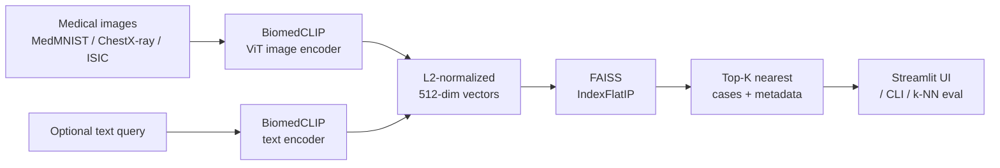

# MedEmbed

> Visual similarity search for medical images using frozen vision-transformer embeddings.

[](https://github.com/YOUR_USERNAME/medembed/actions/workflows/ci.yml)
[](https://www.python.org/downloads/)
[](LICENSE)

MedEmbed turns a medical image into a semantic fingerprint using a pretrained vision-language transformer ([BiomedCLIP](https://microsoft.github.io/BiomedCLIP/)) and then finds visually similar cases in a FAISS index — in milliseconds, with **no model training required**. It also supports text queries ("colorectal adenocarcinoma with desmoplastic stroma") against the same image index, CLIP-style.

It's a minimal, honest take on the pattern underlying most modern clinical retrieval systems: frozen foundation model + vector index + thin UI. Build it once, point it at any medical imaging dataset, and you have a working "find cases like this" tool.

---

## Why

Radiologists, pathologists, and biomedical engineers routinely ask: *"have we seen something like this before?"* The textbook answer is a case library, but nobody has time to browse one. A well-pretrained vision transformer already knows enough about medical imagery that its frozen embeddings support useful similarity search out of the box — you don't need to fine-tune, you don't need a GPU at query time, and you don't need labeled data.

This repo shows the whole pipeline end-to-end in under 500 lines of Python.

## Features

- **Frozen BiomedCLIP backbone** (15M biomedical image-text pairs, PubMed Central)
- **Pluggable model registry** — swap in generic CLIP ViT-B/16 or ViT-B/32 in one line
- **FAISS inner-product index** on L2-normalized vectors (cosine sim, exact search)
- **Image OR text queries** against the same index (multimodal retrieval)
- **k-NN evaluation harness** — macro-F1 + per-class report on any MedMNIST split
- **Streamlit demo app** with side-by-side query + top-K thumbnails
- **Unit-tested core** (numpy utils + FAISS index), CI-ready

## Architecture



Every piece is replaceable: a different backbone, a different dataset, an approximate FAISS index (`IndexIVFFlat`, `IndexHNSW`) when you scale past a few hundred thousand vectors.

## Quickstart

```bash
# 1. Clone and install
git clone https://github.com/YOUR_USERNAME/medembed.git
cd medembed
python -m venv .venv && source .venv/bin/activate
pip install -r requirements.txt

# 2. Build an index over 2000 PathMNIST tiles (~2 minutes on CPU)
python scripts/build_index.py \
    --dataset pathmnist --split test --max-samples 2000 \
    --model biomedclip --out artifacts/pathmnist_test

# 3. Query with an image
python scripts/query.py \
    --index artifacts/pathmnist_test \
    --image path/to/tile.png --k 5

# 4. Or a natural-language query
python scripts/query.py \
    --index artifacts/pathmnist_test \
    --text "tumor epithelium with high nuclear density" --k 5

# 5. Evaluate the embedding space via k-NN classification
python scripts/evaluate.py \
    --index artifacts/pathmnist_test \
    --eval-dataset pathmnist --eval-split val --max-samples 1000 --k 5

# 6. Launch the interactive demo
streamlit run app/streamlit_app.py -- --index artifacts/pathmnist_test
```

## Example results

Replace this table with your own numbers after running `scripts/evaluate.py`.

| Backbone        | Dataset      | Index size | k | Accuracy | Macro-F1 |
|-----------------|--------------|-----------:|--:|---------:|---------:|
| BiomedCLIP ViT-B/16 | PathMNIST  | 10 000     | 5 | —        | —        |
| BiomedCLIP ViT-B/16 | DermaMNIST | 7 000      | 5 | —        | —        |
| CLIP ViT-B/16 (generic) | PathMNIST | 10 000  | 5 | —        | —        |

The point is the **gap**: a medical-domain backbone beats a generic one on medical imagery, without any training.

## Repo layout

```
medembed/
├── src/medembed/          # Library code (Embedder, VectorIndex, data, utils)
├── scripts/               # build_index.py, query.py, evaluate.py
├── app/streamlit_app.py   # Demo UI
├── tests/                 # Unit tests (mocked embedder, real FAISS)
├── docs/                  # Architecture notes
└── .github/workflows/     # CI
```

## Roadmap

See [ROADMAP.md](ROADMAP.md). Short version:

1. **v0.1** — MedMNIST + BiomedCLIP + FAISS + CLI + Streamlit (this release)
2. **v0.2** — Fine-tune the projection head with contrastive loss on labeled medical data
3. **v0.3** — Scale to NIH ChestX-ray14; switch to HNSW for sub-millisecond queries
4. **v0.4** — Add radiology-report text cross-retrieval (image → report, report → image)
5. **v0.5** — Docker + a small FastAPI service so the index can back an external app

## Citation

If you use this project, please also cite BiomedCLIP:

```bibtex
@article{zhang2023biomedclip,
  title={BiomedCLIP: a multimodal biomedical foundation model pretrained from fifteen million scientific image-text pairs},
  author={Zhang, Sheng and Xu, Yanbo and Usuyama, Naoto and others},
  journal={arXiv preprint arXiv:2303.00915},
  year={2023}
}
```

## License

[MIT](LICENSE). Medical images used by this project retain their original dataset licenses (MedMNIST: CC BY 4.0).

## Author

**Amirali Hedayati** — M.Sc. Medical Image & Data Processing, FAU Erlangen-Nuremberg.
Built to bridge my hospital-floor medical-device experience with modern vision-language ML.
